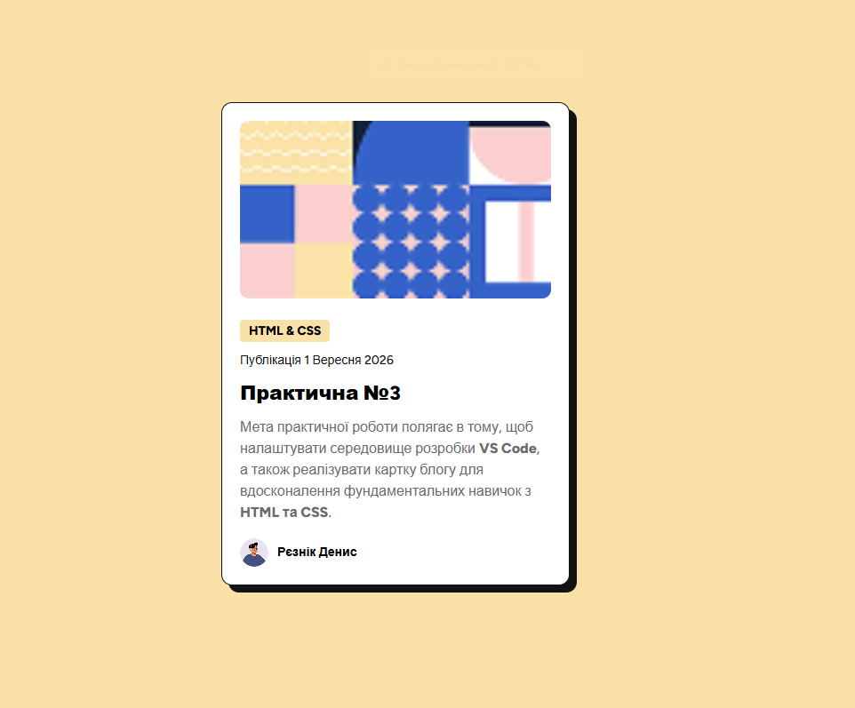

# 📑 Практична робота №3: Семантична верстка картки блогу

## 📝 Опис проекту

Цей проект присвячений створенню адаптивної та семантично коректної картки блогу за наданим макетом. Основна мета — закріплення навичок роботи з **HTML5**, **CSS3 (Flexbox/Grid)** та методологією **BEM**.

Картка реалізована як окремий незалежний компонент, що легко інтегрується в будь-яку частину сайту.

## 🚀 Технології

- **HTML5** (семантичні теги: `<article>`, `<time>`, `<address>`)
- **CSS3** (Custom Properties, Flexbox, ефект зсунутої тіні)
- **БЕМ (Block Element Modifier)** — для чистоти та структурованості класів.
- **Google Fonts** (або локальні шрифти) — шрифт Figtree.

## ✨ Особливості реалізації

- **Точне позиціонування фону:** Використано властивості `background-size` та `background-position` для збільшення та обрізки декоративного патерну (використано ліву нижню частину зображення).
- **Семантика:** Використано правильні теги для дати та автора, що покращує SEO та доступність (Accessibility).
- **Дизайн:** Реалізовано характерну "жорстку" тінь (`box-shadow`) та закруглені кути (`border-radius`), як у сучасному векторі Neo-brutalism.
- **Чистий код:** Жодних вбудованих (inline) стилів або таблиць для макету.

## 📸 Попередній перегляд



## 🛠 Як запустити локально

1. Склонуйте репозиторій:
   ```bash
   git clone [https://github.com/reznik-denis/Pr_3.git](https://github.com/reznik-denis/Pr_3.git)
   ```
